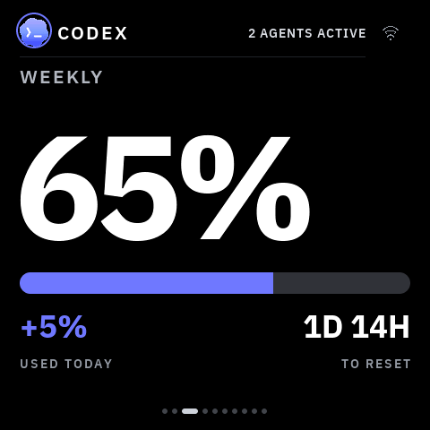
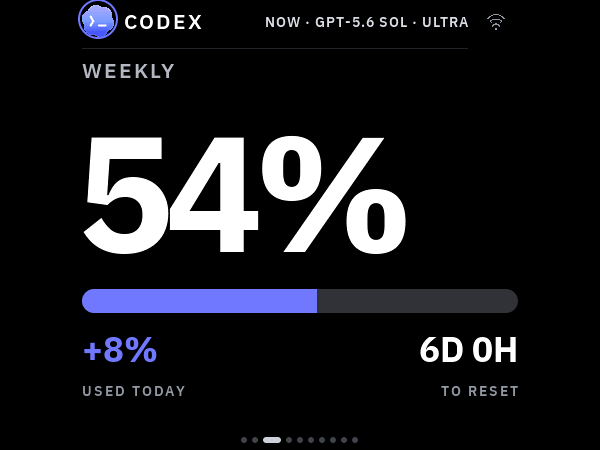

# VibePulse

[](https://github.com/niclasvestlund-YT/vibepulse/actions/workflows/ci.yml)


**A little always-on screen for your shelf that shows what your AI coding
agents are doing — taps you on the shoulder when one is stuck waiting for
you, and (if you want) lets you answer it with a tap on the glass. It packs
too: one command moves it onto whatever WiFi you are on today, and one
button-hold on the panel opens its own settings on the glass.**

Claude Code, Codex, Grok, and Cursor usage, live agent activity, and a full-screen
**NEEDS YOU** alert you can answer with a tap. A three-second hold on the
panel's one user button opens **SETTINGS** on the glass — update the firmware,
teach it a new network, choose Labs displays, or read its address. A ~$30 ESP32-S3 panel plus a
core, pure-stdlib Python service on your Mac or Windows PC. Local mode needs no
VibePulse account and keeps agent activity on your LAN. The optional
numbers-only relay can carry quota data across isolated WiFi; a separate,
default-off encrypted interaction relay can carry supported Needs You
decisions without requiring the panel and computer to share a LAN. A third,
independent **Live agent status relay** can keep the Claude/Codex activity rows
current across ordinary internet WiFi. Every cloud feature is off by default;
only the encrypted interaction/status relay adds the pinned Python
`cryptography` dependency.

Current source supports the original **2.16-inch square panel** and the
**Waveshare 2.41 V2 in 600 × 450 landscape**. For V2 revision checks, build
selection and phone Wi-Fi setup, use the [2.41 V2 guide](docs/waveshare-241-v2.md).

## The problem

When you run coding agents all day, two things are invisible:

- **How much quota is left.** You usually find out you're at the wall when a
  long task dies halfway through — not before you start it.
- **When an agent stopped.** It asks one yes/no question and then just sits
  there. You're in another window. Sometimes for twenty minutes.

Both answers already exist, buried in a terminal you're not looking at.
VibePulse moves them onto a screen you can't miss: one glance from across
the room, no window to switch to, no menu bar to squint at.

> **Status:** v1.1.0. The core shelf-screen loop is real and physically
> exercised on macOS and Windows: see quota, see an agent waiting, and answer
> a supported prompt on the glass. The Windows core, physical answer loop and
> persistent sign-in/sleep/reboot lifecycle were verified at the v1.0.0 host
> runtime and are not re-claimed for a later one. v1.1.0 adds SETTINGS on
> the glass, an honest warm-up, and crash evidence in the firmware. The
> v1.1.0 SETTINGS menu has been on `torget-home-01` since the 2026-09-06 USB
> flash of `v1.0.0-67-ge51b79f`, with its static on-panel review still unrun;
> the warm-up, coredump, ledger and backoff changes and the later LABS
> addition landed after that build and are CI-built, waiting for the next
> flash session. Optional
> integrations remain opt-in, and every platform claim stays tied to its
> recorded evidence.

## Start here

VibePulse is built for vibecoders — people who build with Claude Code or
Codex. You do not need to read this whole page:

1. **Have the board?** Check [What you need](#what-you-need), then follow
   [Setup, the vibecoder way](#setup-the-vibecoder-way): your coding agent
   does the setup with you, one verified step at a time.
2. **No board yet?** [Run the simulator](#no-hardware-run-the-simulator).
   Same pixels, on your computer.
3. **The core is your Claude/Codex usage on the glass.** Answering from the
   panel, the relays, and GitHub are add-ons, each off by default and opted
   into separately: today through the setup command, `secrets.h`, and the
   table under [Independent switches](#independent-switches). A **3 s KEY3
   hold opens [SETTINGS](#one-button-one-menu)** on the glass — UPDATE, WIFI, LABS and ABOUT; the
   LABS choices are saved and apply after restart. Sound has no verified
   backend yet.
4. **Choose what to add later:** [Vibe Labs](docs/labs/README.md) lists the
   the base installation, optional analytics/integrations and future ideas. GitHub Stars is available; standalone reset clocks and coding quotes
   are concepts. New installs start with quotas and activity; analytics are
   optional in SETTINGS → LABS.

## Latest release: v1.1.0

The first release after 1.0 gives the panel a menu and a memory. A
three-second **KEY3** hold opens **SETTINGS** on the glass (UPDATE, WIFI,
ABOUT), so the maintenance window is chosen rather than guessed. The service
answers the panel at once after a restart while the first history scan runs,
labelling the volume counters as placeholders instead of letting the glass go
STALE. A panic now leaves an ELF coredump in flash and a reboot ledger in
NVS, every device poller backs off from a dead service, and the logging
configuration is pinned by a configure-time guard. The host quarantines a
corrupt state file instead of wiping it, says why the Claude probe is idle,
names the keychain failure, typesets any model id, and the whole tokenserver
directory now reads in English. Never a number it did not measure, still.

### v1.1.0 verification

| Gate | Result |
|---|---|
| Host gate (`./test/run.sh`), tokenserver suite on ubuntu, macOS and Windows, both Workers, snapshot tool | **PASS** on every merged PR and on merged `main` |
| ESP32-S3 firmware build | **PASS** in CI — a build, not a flash |
| SETTINGS (UPDATE / WIFI / ABOUT) on the physical panel | **FLASHED, NOT REVIEWED** — `torget-home-01` runs `v1.0.0-67-ge51b79f` (USB, 2026-09-06), which carries the v1.1.0 menu; the static on-panel review, §3 of [`docs/manual-test-key3.md`](docs/manual-test-key3.md), has not been run |
| Warm-up placeholders, coredump, reboot ledger, poller backoff, and the SETTINGS → LABS addition on the physical panel | **NOT YET FLASHED** — all landed after `e51b79f`; the run sheet is [`docs/flash-session-2026-09.md`](docs/flash-session-2026-09.md) |
| Windows v1 host claim (core, physical answer loop, lifecycle) | **Pinned to v1.0.0's runtime `bee5d8c`** — not re-run for this release |

The coredump partition is new in the table, and OTA never writes the table:
one USB `idf.py -p <port> partition-table-flash` is needed before a dump can
land, and the boot log says so until then.

[Read the v1.1.0 notes](docs/releases/2026-09-10-settings-and-evidence.md)
· [Windows v1 evidence](docs/superpowers/reviews/2026-08-28-windows-v1-full-lifecycle.md)
· [Full changelog](CHANGELOG.md)
· [Compare v1.0.0...v1.1.0](https://github.com/niclasvestlund-YT/vibepulse/compare/v1.0.0...v1.1.0)

Contributing or validating another host? Read
[CONTRIBUTING.md](CONTRIBUTING.md), the
[host support matrix](docs/platform-support.md), and
[SECURITY.md](SECURITY.md) before sharing logs or test evidence.

## What's on screen

Claude, Codex, Grok and Cursor quota pages form the new-install base.
Grok follows the Codex page. Cursor splits the same layout into four equal
cells: Total, Cursor models, Third Party, and Grok Bot. The examples below also show
optional LABS pages: burn rate, two Max Trackers, API-equivalent Value and a
GitHub project pulse. Value needs priced usage; its comparison says
`SET YOUR PLAN COST` until a plan cost is configured. Choose the pages you
want in SETTINGS → LABS and restart to apply. The screenshots are native
480×480 LVGL output; physical review status is recorded with each feature.

<table>
<tr>
<td width="50%"></td>
<td valign="top">

**Usage** — Claude's weekly and heaviest-model-weekly window, Codex's weekly
window, Grok's subscription credits, and Cursor's four plan bars. Codex,
Cursor, and Grok show what is left; Claude shows how much of the window is
used. Each has a reset countdown. Today's burn stays a dash until that
window has a delta.

</td>
</tr>
<tr>
<td></td>
<td valign="top">

**NEEDS YOU** — when an agent blocks on your input, the whole screen turns
into the alert, in that provider's colour, naming the project it's waiting
on. Tap to dismiss — or, with the opt-in Needs You bridge, **tap to answer
it** without switching windows
([see below](#answer-claude-or-codex-from-the-panel)).

</td>
</tr>
<tr>
<td></td>
<td valign="top">

**Live agent monitor** — the header shows which agents are working right
now, with model and effort, on every page. `2 CHATS ACTIVE` when several
are running.

</td>
</tr>
<tr>
<td></td>
<td valign="top">

**Burn rate** — a forecast per provider: on pace, running out early (and
when), or how much head-room is left at reset.

</td>
</tr>
<tr>
<td></td>
<td valign="top">

**Max Tracker** — a GitHub-style heatmap of your daily quota peaks, with
coding streaks and max counters, per provider. Red cells are days you
maxed out.

</td>
</tr>
</table>

Both providers get equal treatment — same pages, same alert, their own
accent colour:

**Codex weekly quota**



**Codex NEEDS YOU alert**


**Claude Max Tracker**


### Answer Claude or Codex from the panel

The panel becomes an *input device*. With the opt-in Needs You bridge, when
Claude Code or Codex blocks on a supported question or permission, the
takeover appears and **a tap answers it in the same live session** — no window
to switch to. The computer must be awake and the tokenserver must be running.
Direct mode uses the LAN. The separate encrypted interaction relay works when
the panel and computer use unrelated ordinary internet Wi-Fi: both sides make
outbound HTTPS connections, so there is no router reconfiguration, inbound
port, public Mac, or VPN. Cloudflare handles only fixed-size ciphertext; see
the [privacy and setup guide](docs/interaction-relay.md).

<table>
<tr>
<td width="33%"></td>
<td width="33%"></td>
<td width="33%"></td>
</tr>
</table>

**Attract → decision → done.** A held prompt surfaces as a mascot in a
depleting countdown ring; a tap reveals it; **APPROVE** commits the agent's
explicitly recommended option (or **LEAVE IT** hands it back to the computer),
and the flow closes on a short "ON IT" beat. The panel signs every verdict with a
key shared only with your computer — it can answer a prompt that computer was
already going to ask about, and nothing more. Walking away always costs
nothing: an unanswered prompt just falls back to the terminal. Setup is in
[docs/agent-setup.md](docs/agent-setup.md).

For Codex, only its narrow safe-command tier can show **ALLOW ONCE**. Unknown,
mutating, secret-bearing, or text that does not fit stays on the computer;
silence never means approval. Recommended questions are equally strict: Codex
must mark one of two or three options itself. VibePulse never guesses.

After a firmware or Codex-bridge change, use the canonical physical smoke test
in [docs/agent-setup.md](docs/agent-setup.md#post-flash-physical-codex-smoke-test).
A pass requires visible **APPROVE**, a real panel tap, and the matching answered
result back in Codex. A waiting screen, timeout, **LEAVE IT**, or computer
fallback is not a pass.

### Independent switches

VibePulse is open source, so installing one part never silently enables
another. Each row is an independent switch and every interaction/cloud choice
starts off:

| Switch | What it does | Default |
|---|---|---|
| **Claude interactions** | Lets Claude Code questions and permissions reach the panel | Off |
| **Codex interactions** | Lets supported Codex questions and permissions reach the panel | Off |
| **Numbers relay** | Publishes only quota, reset, Max Tracker, and optional public GitHub numbers | Off |
| **Interaction relay** | End-to-end encrypted question/verdict mailbox for unrelated WiFi | Off |
| **Live agent status relay** | End-to-end encrypted Claude/Codex activity rows for unrelated WiFi | Off |
| **GitHub** | Shows one public repository's page and/or star notification | Off |

Installing the Codex plugin does not enable Codex interactions. Setup asks
whether to enable Claude, Codex, both, or neither, and whether bounded detail
may reach the panel. The old `--interactions` is a legacy alias for Claude only;
use the explicit setup command for new installations. The numbers relay and
interaction relay are different privacy choices and neither is enabled by the
plugin. Installing the Codex plugin does not enable the encrypted interaction
relay or the live agent status relay.

### Optional GitHub project pulse

One public `owner/repository` can add a deliberately sparse optional page:
the current star count is the hero and forks are the only secondary metric.
The same raster covers every data provenance, so the glass never lies about
freshness:

**Live**


**Cached / stale**


**Waiting (no data)**


The page and star moments are independent switches. A new star can therefore
briefly take over the current VibePulse view even when the GitHub page is not
in rotation. It covers the previous page with a quiet black stage, shows a
large filled star, the repository, the stargazer when GitHub supplies one,
the new total, and `TAP TO DISMISS`; otherwise it returns to the exact
previous page after two minutes.


The computer service polls GitHub's public API and republishes a small, validated
LAN payload. The ESP32 never talks to GitHub, and a GitHub timeout or rate
limit cannot stall the Claude/Codex endpoints. Configure it with:

```
python3 tools/tokenserver/tokenserver.py --github-repo owner/repository
```

On Windows, persist the same source in Task Scheduler instead of relying on a
foreground shell:

```powershell
.\tools\tokenserver\install-windows-task.ps1 `
  -GithubRepo "owner/repository"
```

Then open SETTINGS → LABS → MORE on the panel and enable **GITHUB PAGE**
and/or **STAR POPUP**. Restart the panel to apply the saved choices. Both start
off on a new installation; the old `secrets.h` macros seed defaults only until
a choice is saved. No GitHub token is required for a public repository.

`TK_GITHUB_SOUND_ENABLED` is a separate default-off gate for the 258 ms
A5-to-C#6 chime. The sequence and failure-isolated playback contract are in
place, but the current target intentionally registers no codec backend until
the physical speaker and display-DMA budget have passed device testing. A
missing or failed sound backend never delays the popup or any network path.

### It never makes numbers up

<table>
<tr>
<td width="35%"></td>
<td valign="top">

Before the first successful fetch, and whenever a source is missing, you get
dashes — never a placeholder `0%` that you might believe. If the service
goes away, the last good numbers stay on screen and get marked stale rather
than silently drifting.

On current firmware a wall-powered panel also protects itself against the
specific failure where Wi-Fi still looks associated but application HTTP has
stopped. Once the quota feed has worked at least once, and only when an
independent numbers relay is configured, 60 seconds without a fresh response
recycles Wi-Fi and wakes the quota task, which waits for a new IP before
retrying. If no real success follows within another 45 seconds, the device restarts once to clear
wedged HTTP/TLS state. A reboot is disarmed until a new real success, so a real
internet outage cannot become a restart loop. LAN-only installations never
perform this automatic recovery just because their computer is asleep.
After that controlled restart, the panel sends a fixed content-free recovery
marker on local requests. `GET /` exposes it only as
`interactions.panel.httpStallRecoveryBoot`; setup doctor and the next Codex
startup can therefore distinguish a recovered wall-powered panel without a
USB serial cable. It contains no hostname, address, account, or usage value.

Run Claude only, or Codex only, and the other half simply shows dashes.

</td>
</tr>
</table>

### Are you getting your money's worth?

<table>
<tr>
<td width="35%"></td>
<td valign="top">

The usage pages answer *how much have I spent?*. The
[**value multiple**](docs/value-multiple.md) answers the question you
actually have every month: it prices the tokens your agents already logged
at list API rates and divides by what you pay. It's its own page on the
swipeable strip, alongside GitHub — neither replaces the other.

</td>
</tr>
</table>

```
python3 tools/tokenserver/tokenserver.py --claude-plan max5x --plan claude=100
```

The equivalent persistent Windows setup is explicit per provider and never
guesses what you pay:

```powershell
.\tools\tokenserver\install-windows-task.ps1 `
  -ClaudePlan max5x -ClaudePlanCostUsd "100" `
  -CodexPlan pro -CodexPlanCostUsd "20"
```

It counts cache tokens, which is the whole point — a real record here reads
2 input and 4 output against 23 655 cache-read, so pricing only input and
output understates it by 577x.

Rates are not hand-maintained: they are generated from a public price
catalogue by `tools/tokenserver/update_prices.py` and committed, so the
server stays offline and refreshing is one command. An unknown model degrades
the figure to a dash rather than being silently free.

## How it works

```
      your computer                          your shelf
┌────────────────────────────┐          ┌──────────────┐
│ ~/.claude/projects/*.jsonl │          │              │
│ ~/.codex/sessions/*.jsonl  │ ───────► │   ESP32-S3   │
│ rate-limit headers         │          │    AMOLED    │
└────────────────────────────┘          └──────────────┘
     tokenserver.py :8737           plain JSON over your LAN,
     pure Python stdlib                polled every 30 s
```

A tiny Python service on your Mac or Windows PC reads your local Claude Code / Codex logs
and rate-limit headers, and serves plain numbers over your LAN. The screen
polls it every 30 seconds. Your OAuth token never leaves the computer; the screen
only ever receives percentages, counts and coarse status.

The computer must be on for fresh local data. It does not have to stay in the
same house when a relay is enabled, but it does have to run the tokenserver so
there is something to publish. A phone hotspot is fine after it has been taught
to the panel; captive portals and 5 GHz-only networks are not.

The startup/doctor health check also guards Claude's saved usage credential.
`GET /` exposes only `claudeCredential.status` and whole minutes remaining—
never an access or refresh token—and warns 30 minutes before expiry. This
matters because Claude Desktop can remain logged in after the separate
credential readable by VibePulse has aged out; stale Fable data is never
reported as current. Read that guard together with `claudeProbe` and the
`/api/tokens` stale flags: a successful probe plus a fresh model-week flag
means the current source is live even if the saved fallback is expired. That
is a future recovery risk, not a reason to restart the tokenserver.

Optionally, Claude Code itself can feed the quota: `python3
tools/vibepulse_setup.py statusline install --yes-single-account` points
Claude Code's `statusLine` at a small bridge that keeps the session and
weekly windows Claude Code already hands that command, then runs the status
line you had before. Each window is arbitrated against the OAuth probe
(the later reset wins, within one window the higher figure), and while a
fresh sample covers both windows the probe slows to every 30 minutes, so
the shared rate-limit bucket is spent less. It asks you to confirm that Claude Code and the
tokenserver use the same Claude account; see
[docs/agent-setup.md](docs/agent-setup.md).

Codex plugin `0.1.7` turns the trusted `SessionStart` hook into a real bounded
health check. It reads only the two loopback JSON endpoints, follows no
redirects, times out in under a second, and injects one content-free class into
the new task:

| Startup class | What it proves | First action |
|---|---|---|
| `HEALTHY` | Provider data and recent direct panel polling are fresh | None |
| `HEALTHY AFTER DEVICE SELF-RECOVERY` | The same, after the bounded HTTP-stall restart | Keep observing past the stale window; this is evidence, not a physical PASS |
| `PROVIDER DATA STALE` | Claude and/or Codex source data is stale | Run setup doctor and tokenserver smoke; inspect the named provider |
| `DEVICE PATH STALE` / `PANEL LAN WAITING` | Host data is fresh but direct glass polling is stale or unconfirmed | Check panel power, network, discovery, and firmware before restarting a healthy host |
| `SERVICE VERSION DRIFT` | The loaded plugin and live tokenserver came from different source revisions | Repair all integrations from one durable checkout and start a new task |
| `SERVER UNAVAILABLE` / `LOCAL API DEGRADED` | The local service or its diagnostic contract is unavailable | Run setup doctor and tokenserver smoke |

The hook diagnoses; it never approves, flashes, refreshes credentials, or
silently rewrites service configuration. Firmware self-recovery remains
bounded and fail-closed, while host repair remains an explicit setup action.

## What you need

Four things. All four are required for the core — your usage on the glass.
No VibePulse account, no cloud service, no API key — you sign in to
Claude Code or Codex as you already do, and nothing else. The **service on
your computer** needs only
Git and Python; the [Windows host runbook](docs/windows-setup.md) has the
`winget` commands and download links for both. Putting the firmware on the
board is the one step that needs more, and row 1 says what.

| | You need | Because |
|---|---|---|
| **1. A screen** | One of the boards below, a USB-C cable, and **its own USB power supply**. Flashing it also needs the **ESP-IDF 5.5 toolchain** with CMake and Ninja, one time | a computer USB port usually cannot feed the running AMOLED; the firmware is built from source until the browser installer lands |
| **2. A computer** | A Mac or a Windows PC with **Git** and **Python 3.11+**, awake whenever you want fresh numbers | the VibePulse service runs here and reads your agents' local usage |
| **3. An agent on that computer** | **Claude Code and/or Codex, installed and signed in.** Either alone is fine | that is where the numbers come from |
| **4. WiFi** | A **2.4 GHz** network that both the screen and the computer can reach | the ESP32-S3 cannot see 5 GHz; the optional relay lifts the same-network rule later |

Flashing the firmware currently also needs
[ESP-IDF 5.5](https://docs.espressif.com/projects/esp-idf/en/stable/esp32s3/get-started/index.html)
on the computer — see [Setup](#setup-the-vibecoder-way). A browser-based
installer is planned so that this step disappears.

### Supported screens

**Affiliate disclosure:** Product links marked **affiliate** may earn Niclas
Vestlund a commission. Waveshare supplied hardware for development and testing.
The support status below reflects our own verification of each model.

| Board | Display | Status |
|---|---|---|
| [Waveshare ESP32-S3-Touch-AMOLED-2.16](https://www.waveshare.com/esp32-s3-touch-amoled-2.16.htm?&aff_id=179337) (affiliate) | 480×480 AMOLED, touch. Also on the board: an IMU, and an ES8311 codec with amplified speaker output; **whether a speaker is fitted is unconfirmed**, and neither is verified on the unit | **Display, touch, and Wi-Fi verified on a real unit** (`spec/hardware-capabilities.yaml` is the source of every such claim). Its simulator frames are exact 480×480 renders. No soldering. Same board Clawdmeter uses. |
| [Waveshare ESP32-S3-Touch-AMOLED-2.41](https://www.waveshare.com/esp32-s3-touch-amoled-2.41.htm?&aff_id=179337) (affiliate), **V2 / Rev2.0 only** | 600×450 AMOLED in fixed landscape, capacitive touch; BOOT opens settings | **Supported in current source.** Display bring-up, portrait corner touch, Wi-Fi and owner-visible Codex/Claude usage verified. [Install guide](docs/waveshare-241-v2.md) · [exact evidence](docs/superpowers/reviews/2026-09-17-waveshare-241-v2-physical.md). V1, automatic rotation, OTA and physical answer replies are not validated by this port. |

The v1.1.0 tag predates the V2 port. Use current source and the explicit
`waveshare_241_v2` build profile; firmware images are board-specific.
More boards are added after physical verification, following
[Adding a display](docs/adding-a-display.md). The 2.16 registry remains under
[`spec/`](spec/hardware.md); V2 has its own
[hardware registry](spec/boards/waveshare_241_v2/hardware.md).

#### 2.41 V2 landscape

<p align="center">
  
</p>

*On the real 2.41 V2: owner-supplied photo, added September 18, 2026.
The display runs in landscape; the board is held at an angle in the photo.*

<p align="center">
  
  
</p>

These are exact 600×450 captures from the shared LVGL renderer with test data.
The native fonts/icons are retained; margins, frames and footers fit the
shorter display. Hold **BOOT** for three seconds for SETTINGS, then **WIFI**
to provision locally. The [V2 guide](docs/waveshare-241-v2.md) includes backup,
recovery, sources and troubleshooting.

### Coming soon — hardware on the workbench

These boards have arrived for development. **No VibePulse firmware is available
for them yet**, and there is no release date. Each port must pass the
[display bring-up and physical verification checklist](docs/adding-a-display.md)
before moving into the supported table above.

The product links below are **affiliate links**: Niclas Vestlund may earn a
commission. Waveshare supplied this development hardware.

| Planned VibePulse port | Status |
|---|---|
| [ESP32-S3-Touch-AMOLED-1.75](https://www.waveshare.com/esp32-s3-touch-amoled-1.75.htm?&aff_id=179337) (affiliate) | Received · coming soon · not supported yet |
| [ESP32-S3-Touch-AMOLED-1.8](https://www.waveshare.com/esp32-s3-touch-amoled-1.8.htm?&aff_id=179337) (affiliate) | Received · coming soon · not supported yet |
| [ESP32-S3-Touch-AMOLED-1.91](https://www.waveshare.com/esp32-s3-amoled-1.91.htm?sku=28596&aff_id=179337) (affiliate) | Received · coming soon · not supported yet; link selects the touch variant |

Also received for **VibeMatrix experiments**: the controller, three LED panels
and a power adapter below. This is an exploratory direction; it does not yet
provide a working VibePulse installation or a validated wiring/power guide.

| Experimental hardware | Received |
|---|---|
| [ESP32-S3-RGB-Matrix](https://www.waveshare.com/esp32-s3-rgb-matrix.htm?&aff_id=179337) (affiliate) | 1 controller |
| [RGB-Matrix-P2.5-64x32-B](https://www.waveshare.com/rgb-matrix-p2.5-64x32.htm?sku=33839&aff_id=179337) (affiliate) | 3 LED panels |
| [PSU-5V4A-5.5-2.1-EU](https://www.waveshare.com/psu-5v-4a-5.5-2.1-us.htm?sku=17679&aff_id=179337) (affiliate) | 1 power adapter; SKU selects the EU plug |

For maintaining these product links, see the [affiliate link notes](docs/affiliate-links.md).

### Supported computers

| Computer | Status | Autostart |
|---|---|---|
| macOS | **Supported.** Daily development and physical panel reviews. macOS ships an older Python; `brew install python` gives you 3.11+ | launchd |
| Windows | **Supported.** v1 core, the physical answer loop, and the sign-in/sleep/reboot lifecycle verified on a real PC | Task Scheduler |
| Linux | **Not yet.** Tracked in [#2](https://github.com/niclasvestlund-YT/vibepulse/issues/2) | — |

"Supported" means the computer service; it does not claim that every
developer builds or flashes the firmware from that OS. The evidence behind
each row is maintained in **[Host platform support](docs/platform-support.md)**.
Windows installation and recovery use the
**[Windows host runbook](docs/windows-setup.md)**, and release candidates go
through the reproducible **[Windows validation gate](docs/windows-validation.md)**.
"Supported" also does not mean every later candidate has passed the physical
Windows loop: the v1 runtime's latest sanitized checkpoint is a
**[FULL PASS](docs/superpowers/reviews/2026-08-28-windows-v1-full-lifecycle.md)**,
and future runtime revisions require a fresh run rather than inheriting it.

## Setup, the vibecoder way

You do not set VibePulse up by hand. Your coding agent does it with you,
step by step, verifying as it goes. Clone the repo and start the agent you
already use, in that folder. The same three lines work in a Mac or Linux
shell and in Windows PowerShell 5.1 and 7:

**Claude Code**

```
git clone https://github.com/niclasvestlund-YT/vibepulse.git
cd vibepulse
claude "Set up VibePulse for me: help me fill in secrets.h, build and flash the board over USB, and start the tokenserver on this computer."
```

**Codex**

```
git clone https://github.com/niclasvestlund-YT/vibepulse.git
cd vibepulse
codex "Set up VibePulse for me: help me fill in secrets.h, build and flash the board over USB, and start the tokenserver on this computer."
```

Any other agent (Cursor, Copilot, …): open the folder and paste the same
sentence.

The repo is built for this. `CLAUDE.md` and `AGENTS.md` point the agent
straight at **[docs/agent-setup.md](docs/agent-setup.md)** — an English
runbook written for agents, with a verification after every step, the traps
that actually cost people an evening, and a symptom→fix table. The agent
asks before it flashes the board; nothing is written to the screen without
your go-ahead. That's the whole onboarding.

Reading rather than running? That runbook is also the fastest way to
understand how the pieces fit together.

## Setup, the manual way

**Select the board first.** The commands below build the original 2.16 profile.
For 2.41 V2 use the separate [V2 build/flash sequence](docs/waveshare-241-v2.md);
do not flash the default image to it.

The commands below show the macOS path. Windows is supported for the host
service too; use the Windows ESP-IDF environment and the OS-specific
[Windows host runbook](docs/windows-setup.md) for the standalone Codex CLI,
host address, firewall, Task Scheduler, startup health, and recovery steps.

1. Install [ESP-IDF 5.5](https://docs.espressif.com/projects/esp-idf/en/stable/esp32s3/get-started/index.html)
   and `brew install cmake ninja`
2. Clone this repo, then:

   ```
   cp secrets.h.example secrets.h   # fill in WiFi + your Mac's hostname (2 min)
   . ~/esp/esp-idf/export.sh
   idf.py set-target esp32s3
   idf.py build
   idf.py -p /dev/cu.usbmodem101 flash
   ```

   **Don't miss this:** in `secrets.h`, point the `TK_VIBEPULSE_BASE_URL`
   fallback at a reachable host by replacing the `DIN-MAC` placeholder. Those URLs ship
   active on purpose — a wrong hostname is visible in the log, whereas an
   undefined URL compiles the fetch out entirely and the screen boots fine
   and shows dashes forever. Use your Mac's Bonjour name
   (`scutil --get LocalHostName`) rather than an IP, so the same firmware
   works on your home network and on a phone hotspot. Current firmware also
   discovers `_vibepulse._tcp.local`, so several Mac/Windows tokenservers can
   be available without compiling their addresses into the panel.

   Board not showing up under `/dev/cu.usbmodem*`? Hold **BOOT**, tap
   **RESET**, release **BOOT** and it re-enumerates in download mode.

   **Power matters:** flash with the board in download mode (screen dark).
   A computer USB port often cannot feed the running firmware. The AMOLED
   panel's draw makes the board bounce off the bus or hang, which looks
   like a flaky cable. After flashing, run the screen from its own USB
   power supply, not your computer.
   The firmware disables Wi-Fi modem sleep because the panel is an
   always-powered live display; do not re-enable it without repeating a
   sustained stale-window and interaction test on physical hardware.
3. Start the core service on your computer. Its core remains pure Python
   stdlib. Install the small optional discovery dependency when the panel
   should find this Mac/PC automatically:

   ```
   python3 -m pip install -r requirements-discovery.txt
   python3 tools/tokenserver/tokenserver.py
   ```

   Without that package the configured URL path works exactly as before.

   On macOS, validate and install autostart from this durable checkout with
   `python3 tools/vibepulse_macos_service.py validate` followed by the explicit
   `install` command. It atomically rewrites and fully reloads the LaunchAgent,
   retries launchd's short post-`bootout` race within a fixed bound, and keeps
   launchd from running a deleted PR worktree. Full details:
   [tools/tokenserver/README.md](tools/tokenserver/README.md).

## Vibe Labs: start small, add later

New installations using `secrets.h.example` show quotas with reset information
and local activity when available. In **SETTINGS → LABS**, add burn rate,
Max Tracker, API-equivalent value, a GitHub page or independent star popups.
Tap to save a choice, then restart the panel to apply it. GitHub needs a
repository configured on the computer; Value needs prices and a plan cost for
its comparison. These choices do not start cloud services.

<p align="center">
  
  &nbsp;
  
  &nbsp;
  
</p>

Existing configurations retain their initial views; saved menu choices survive
firmware updates. Disabled pages are not created at boot. The new selector
has shared LVGL simulator coverage; physical memory and touch review are
pending before release. [Setup, defaults and future experiments](docs/labs/README.md).
Countdown clocks and coding quotes remain concepts for a later Labs addition.

## One button, one menu

**2.41 V2:** hold **BOOT for three seconds** to open SETTINGS, then choose
WIFI, LABS or ABOUT. Use the [V2 guide](docs/waveshare-241-v2.md) for USB
updates; OTA is not validated on this model.

The details and 480×480 captures below describe the **original 2.16**.
**KEY3** is that panel's one user button — BOOT and reset are recovery
controls, not part of normal use. Hold KEY3 for three seconds and
**SETTINGS** opens on the glass.

<p align="center">
  
  &nbsp;
  
  &nbsp;
  
</p>
<p align="center"><em>Real 480×480 frames from the shared LVGL firmware renderer: the menu, the same menu on a panel with no network, and ABOUT.</em></p>

- **UPDATE** opens the ten-minute maintenance window an over-the-air upload
  needs — see [Over-the-air updates](#over-the-air-updates).
- **WIFI** opens the setup window that teaches the panel a new network — see
  [Take it with you](#take-it-with-you).
- **LABS** saves optional display features; restart to apply them. See
  [Vibe Labs](#vibe-labs-start-small-add-later).
- **ABOUT** shows the firmware version and the panel's address, and nothing
  else. No token, no device key, no password: every line on it is already in
  the logs or on the glass somewhere else.

**The menu replaced a guess.** The same hold used to open one window or the
other depending on whether the panel happened to have an address. The panel
decided, silently, and you found out by watching which one appeared. Now the
choice is visible and yours.

**A window the panel cannot use is never offered.** With no address, UPDATE
goes grey *and* refuses the press — a maintenance window with no address
could never receive an upload, so offering it would be a promise the screen
cannot keep. UPDATE is the only row that goes dark — WIFI, LABS and ABOUT stay
lit — which leaves WIFI as the only row that can change the situation, and
that is exactly where a panel in that state needs to go. ABOUT shows the
address as a dash rather than inventing one. If the network drops while the
menu is open, UPDATE greys out there and then; it is a live reading, not a
snapshot taken when you opened it.

**Any KEY3 press closes it.** That is the escape hatch, and it is the same
one the two windows have — including a press part-way through another hold.
While an **UPDATE READY** notice is on the glass a hold does nothing at all,
so SETTINGS can never open behind something you cannot see; answer that
notice with its own LATER and UPDATE pills instead.

**The consent model is unchanged by any of this.** SETTINGS is reachable
only from the device, so physical presence is still required before an
update window can open, and the OTA token and the ten-minute lease are
untouched. No script can reach the menu, and nothing but a finger on the
UPDATE row opens the window behind it.

FEATURES and PAIR are in the design spec and deliberately not built yet:
FEATURES needs the panel's internal-RAM budget re-measured on the unit
first. Three rows that work beat five where two are promises the screen
cannot keep.

> **Evidence, honestly:** the frames above come from the shared LVGL
> renderer in the simulator, and the behaviour is covered by host tests.
> `torget-home-01` has carried SETTINGS since the 2026-09-06 USB flash
> (`v1.0.0-67-ge51b79f`), but the static on-panel review — §3 of the manual
> test — has not been run, so nothing here is a physical verification; that
> review is the next gate.

## Over-the-air updates

This section describes **2.16**. The **2.41 V2** port currently uses
[board-specific USB updates](docs/waveshare-241-v2.md#4-back-up-and-install-over-usb).

After the first USB flash, the screen updates itself over WiFi. The consent
chain is deliberate and three-factor: a **physical 3-second hold on KEY3**
opens **SETTINGS**, where **UPDATE** starts a ten-minute maintenance window
(the glass shows an UPDATES ON ring with the lease draining clockwise), a
**64-hex token** from `secrets.h` authenticates the upload, and the window
**closes itself** — a short KEY3 press closes it early. No button, no
update; a script can never open the window for you. (On a panel *without*
a network, UPDATE is greyed out and WIFI is the row that can fix it — an
update window with no address could never receive an upload. See
[Take it with you](#take-it-with-you).)

```
idf.py build
tools/ota-flash.sh <device-ip>     # waits for KEY3 hold → UPDATE, then uploads
```

The hold opens **SETTINGS** rather than guessing which window you wanted,
and on a panel with no address UPDATE is greyed out and cannot be picked.
The frames are in [One button, one menu](#one-button-one-menu).

The device verifies the image (magic, chip, project, SHA-256), writes it to
the **inactive A/B slot** (`ota_0`/`ota_1`, 5 MB each — see
`partitions.csv`), reboots into it, and a **boot-health gate** must approve
the new image within 15 seconds — display, UI, scheduler, NVS and memory
proofs — or the bootloader rolls back to the previous slot automatically.
USB-C remains the rescue path and is never written by an OTA. After an OTA
reboot the window re-arms itself once, so a build-test-build session needs
one hold, not one per build.

The tokenserver announces the newest build on your computer
(`otaAvailableVersion` on `/api/tokens`); when the screen runs an older
version it takes the glass with an **UPDATE READY** notice — answer it with
the on-glass LATER/UPDATE pills by touch. While that notice is up it owns
the glass completely: a KEY3 hold does nothing, deliberately, so SETTINGS
can never open behind it. The UPDATE pill opens the same maintenance window
the menu's UPDATE row does. A snooze returns every hour until installed. Full lifecycle reference: [docs/ota.md](docs/ota.md).

**If someone tells you "this project has no OTA":** they are reading a tree
where `partitions.csv` still has a single `factory` partition. The OTA
foundation replaced that table (A/B slots + `otadata`) — check the branch
you are on before concluding anything, and never assume the flash layout
without reading `partitions.csv` in the checkout you are actually building.

## Take it with you

The panel remembers up to six places. Arrive somewhere new and it needs the
network once; every visit after that it joins by itself.

<p align="center">
  
  &nbsp;
  
  &nbsp;
  
</p>
<p align="center"><em>Real 480×480 frames from the shared LVGL firmware renderer: recovery, phone-first QR setup, and the global signal indicator.</em></p>

The normal setup path needs only the panel and a phone:

1. **Scan the QR** on the panel. It joins your phone to the temporary
   `VibePulse-setup` network; it does not contain your destination Wi-Fi
   password. The normal screen keeps the QR dominant; tap **Manual Setup**
   only if you need to see the temporary name, password, and local address.
2. The local setup page should open. If it does not, open
   `http://192.168.4.1/` yourself. A browser label such as **Not Secure** is
   expected here: this is a short-lived, device-local page with no internet
   route, not a public website.
3. Pick a **2.4 GHz** network and tap **Join** once. For a secured network,
   the password field names the selected network and is required. For an open
   network the password field disappears because no password is needed. The
   ESP32-S3 cannot see 5 GHz-only networks. On an iPhone hotspot, enable
   *Maximize Compatibility*.
4. Keep the phone nearby while the glass says JOINING. The new credentials
   are remembered **only after the panel connects** successfully. If the
   password is wrong or the network disappears, old saved networks remain
   available and the panel tells you what to retry.

On a Mac there is also an optional one-command shortcut:

```
tools/wifi-here.sh
```

It reads the network your Mac is already on, takes that password out of your
keychain (macOS asks you — that prompt is the consent), hands it to the panel
over its temporary access point, and gives the Mac's Wi-Fi back. The phone
flow remains the universal path and needs no computer or command line.

The small neutral Wi-Fi symbol is global and two-state: a slashed fan means
the panel is not joined to an access point, a complete fan means it is. It
shows no signal strength, and it **does not mean internet** access,
tokenserver reachability, or relay health. During setup the complete symbol means setup mode, not a
successful destination join.

The setup window opens on its own after 90 seconds without a network, or
at once from a 3-second button hold (**KEY3 on 2.16, BOOT on 2.41 V2**)
followed by **WIFI** in SETTINGS. Before
that, at 60 seconds, the glass stops being coy: it names the network it is
hunting and what the radio actually answered ("NOT SEEN - 2.4 GHZ ONLY", "WRONG PASSWORD") instead of
showing dashes and letting you guess.

On a panel that already *has* a network, the same 3-second hold opens
SETTINGS; tap **WIFI**. That is how you pre-load the phone hotspot at home
before a trip — no need to wait until the panel is stranded somewhere.
(The second-hold shortcut still exists, but only *inside* the update
window: a full hold there closes it and opens WIFI SETUP. From SETTINGS a
second completed hold just closes the menu.)

Two things stay true by design. The networks in `secrets.h` remain an
**immutable floor** — setup can add places, never remove your home network,
so a bad entry can never cost you a USB rescue. And the setup window
**cannot write firmware**: it touches the network list and nothing else,
while OTA keeps its own token and its own gate.

Honest limits: captive portals (the panel cannot click "I agree"), guest
networks with client isolation, and WPA2-Enterprise are all still out of
reach. The network that always works on the road is the one you bring —
your phone's hotspot, with *Maximize Compatibility* on. Teach the panel
that one once and it follows you everywhere. Full reference:
[docs/wifi.md](docs/wifi.md).

And for the networks that *do* connect but wall the panel off from your
machine (client isolation, IoT VLANs): the optional **relay** puts the
numbers in a tiny mailbox on the internet — a ~150-line Cloudflare Worker
on your own account — and the panel falls back to it whenever the LAN
does not answer. Quota, burn rate, Max Tracker and the GitHub pulse
follow you anywhere with WiFi. Agent activity stays local unless you separately
opt in to one or both encrypted activity features. The **Interaction relay**
carries only bounded Needs You views and verdicts. The independent **Live
agent status relay** carries the minimized Claude/Codex rows the panel already
renders. Both use fixed-size, end-to-end encrypted ciphertext; Cloudflare
never receives question, command, project basename, activity, or verdict
content in plaintext. Cloudflare can still see connection IPs, timing and a
random mailbox identifier. The computer must be awake and tokenserver must be
running, but it may use a different ordinary internet connection from the
panel. Several machines can feed the numbers mailbox
(a Mac that sleeps, an always-on PC) and the freshest source wins per
number. Numbers setup: [docs/relay.md](docs/relay.md). Encrypted decisions and
live status: [docs/interaction-relay.md](docs/interaction-relay.md).

## No hardware? Run the simulator

```
brew install sdl2 cmake ninja
cmake -S sim -B sim/build -G Ninja && ninja -C sim/build
./sim/build/torget-sim
```

(On Debian/Ubuntu: `apt-get install libsdl2-dev cmake ninja-build` instead.)

Headless or behind a proxy (CI containers, cloud agent sessions): if the
LVGL tarball download is blocked, clone the same tag and point CMake at it
and run the full configure and build with the override:

```
git clone --depth 1 --branch v9.5.0 https://github.com/lvgl/lvgl.git /tmp/lvgl
cmake -S sim -B sim/build -G Ninja -DFETCHCONTENT_SOURCE_DIR_LVGL=/tmp/lvgl && ninja -C sim/build
```

Without a display, run the simulator and its tests with
`SDL_VIDEODRIVER=offscreen`.

Same code, same fonts, same pixels as the device — it builds the real
platform and VibePulse against the real LVGL, and feeds it the recorded
fixtures in `sim-fixtures/` through the same parsers the board runs. The
flat UI captures in this README are unmodified simulator frames (the
banner places three of them side by side). The separately captioned 2.41 V2
photograph shows the owner's real panel; its evidence is recorded in the
[V2 physical report](docs/superpowers/reviews/2026-09-17-waveshare-241-v2-physical.md).
For the original 2.16, the
[2026-08-13 physical review](docs/superpowers/reviews/2026-08-13-max-tracker-physical-static.md)
covered the quota pages, agent monitor states and Max Tracker pages in that
build. It does not verify later screenshots or firmware: the v1.1.0 SETTINGS
frames are simulator evidence only (SETTINGS is on `torget-home-01` since the
`v1.0.0-67-ge51b79f` flash of 2026-09-06, but its static on-panel review has
not been run), and the rest of this release's firmware changes landed after
that build and remain CI-built and **not flashed**.

Keys: `[` / `]` change VibePulse page, `S` cycles agent status, `M` cycles
Max Tracker fixtures, `T` re-feeds tokens, `G` simulates a new GitHub star,
`N` moves to the next app, `L` opens the launcher, and `1`-`4` pick a
Solelkollen fixture when that companion is checked out.

`K` is KEY3 itself, polled raw rather than on an edge, so the bench drives
the real time gesture: hold `K` for three seconds and SETTINGS opens, release
before three and an open window closes instead. `U` and `W` press the UPDATE
and WIFI rows in that menu, taking the same path a finger does. That makes
the simulator the spec for the gesture — there is no other way to exercise it
without the board.

## Privacy

- In local mode, agent activity and usage stay on your LAN; the screen only
  ever receives percentages, counts and coarse status — a project name, a
  model, an effort level.
- No prompts, no code, no commands, no file contents are stored or served.
  The service keeps only content-free quota points (at most one per 15
  minutes, kept 8 days) for the trends.
- Your OAuth token never leaves the computer.
- The optional numbers relay publishes only quota, reset, Max Tracker, and
  optional public GitHub numbers. The separate interaction and live-status
  relays send fixed-size end-to-end encrypted ciphertext; all three are off
  by default and independently controlled.
- If the optional GitHub module is enabled, the computer anonymously reads
  only public repository and stargazer metadata from GitHub. In local mode,
  the ESP32 still talks only to that computer over your LAN.
- A lost or stolen screen leaks your WiFi credentials and the LAN hostname
  or address of your computer — both of which you rotate yourself, not in any
  cloud.

## Tweak it

<table>
<tr>
<td width="30%"></td>
<td valign="top">

VibePulse is an app on **Torget**, a deliberately small LVGL 9 app platform
for this panel. An app is one component exporting
`torget_app_t { name, icon, create, enter, leave }`; the platform owns WiFi,
the panel, brightness and the launcher.

This repo ships exactly one app, so that's all you get on the screen — one
binary, one thing, nothing to wonder about. The platform can hold several
apps at once (that's what the launcher is for), but any others live in their
own repos and are only built in if you check them out.

</td>
</tr>
</table>

Design rules: true black background, IBM Plex, dashes instead of invented
zeros, and provider accents locked to Claude `#D97757` and Codex `#6F78FF`.

```
platform/            app contract + launcher + fonts (IBM Plex)
main/                ESP32 host layer: boot, WiFi, SNTP, app registry
components/app_*     the app (VibePulse lives in app_tokens/)
tools/tokenserver/   the computer service (core is Python stdlib)
sim/                 SDL simulator, the whole platform on your computer
test/                host tests, run with ./test/run.sh (no ESP-IDF needed)
spec/                hardware truth + UI design system
```

The deeper docs (architecture, writing an app, hardware traps) are in
[README.sv.md](README.sv.md), in Swedish, because this started as a Swedish
hobby project. Your agent reads Swedish just fine.

## Hardware knowledge

Hardware truth — capabilities, sources and which claims are verified on a
real unit — lives in the validated registries under `spec/`. Read
`spec/hardware.md` before any hardware-dependent work, and don't promote a
capability to "verified" without a physical check.

`./test/run.sh` is the host gate that enforces those registries, alongside
the C core tests and the Python suites. No ESP-IDF required, but it does
need a reproducible Python:

```sh
python3.12 -m venv .venv
. .venv/bin/activate
python -m pip install -r requirements-dev.txt \
  -r requirements-interaction-relay.txt
./test/run.sh
```

Python 3.11+ is required. The script uses the activated environment's Python
by default; set `PYTHON_BIN` to point at a different 3.11+ interpreter.

## FAQ

- **Windows for the tokenserver?** Yes. Claude Code has no
  keychain there, so `claude login` writes the same
  `{"claudeAiOauth": {...}}` record to
  `%USERPROFILE%\.claude\.credentials.json` and the service reads it; the
  Codex app-server read and the single-probe lock no longer depend on
  macOS-only syscalls; state lives under `%LOCALAPPDATA%\VibePulse\`.
  For autostart, run the shipped Task Scheduler installer from the repo root:
  `powershell -ExecutionPolicy Bypass -File tools\tokenserver\install-windows-task.ps1`.
  It runs as your signed-in user, starts immediately, restarts on failure, and
  keeps interaction-provider choices in the tokenserver's saved config.
  The Codex desktop app alone is not enough for the background quota read:
  its Store-managed `codex` alias can resolve but still be denied by Windows.
  Install OpenAI's standalone CLI once in PowerShell:
  `powershell -ExecutionPolicy ByPass -c "irm https://chatgpt.com/codex/install.ps1 | iex"`.
  VibePulse prefers its stable per-user executable under
  `%LOCALAPPDATA%\Programs\OpenAI\Codex\bin` and ignores `WindowsApps`
  aliases. Open a new PowerShell window, run `codex --version`, then rerun
  `python tools\vibepulse_setup.py doctor`. The background task writes bounded
  stdout/stderr to
  `%LOCALAPPDATA%\VibePulse\Logs\torget-tokenserver.log`; the server's
  rotation guard keeps one `.old` tail. Use `-ValidateOnly` to verify the
  checkout and Python 3.11+ interpreter without changing Task Scheduler. The
  complete install, hook-review, firewall, startup-health, physical-test, and
  recovery procedure is the [Windows host runbook](docs/windows-setup.md).
  The v1.0 core service, physical answer loop, sign-out/sign-in,
  sleep/resume, and reboot all passed on a real Windows PC; see the
  [full sanitized evidence](docs/superpowers/reviews/2026-08-28-windows-v1-full-lifecycle.md).
  A later runtime revision still requires a fresh pass through the complete
  [Windows validation gate](docs/windows-validation.md); release evidence is
  never inherited across untested code.
- **Linux for the tokenserver?** Not yet —
  [#2](https://github.com/niclasvestlund-YT/vibepulse/issues/2). The Ubuntu
  tokenserver CI lane is portability evidence, not a support claim: current
  `main` still needs XDG paths, Linux credential selection, systemd user
  service lifecycle, and a real-host + panel validation report. See
  [Host platform support](docs/platform-support.md).
- **Other boards or panel sizes?** Current source supports Waveshare **2.16**
  and **2.41 V2**, each with its own build profile and native layout. AMOLED
  1.75, 1.8 and 1.91 are [planned ports](#coming-soon--hardware-on-the-workbench),
  without firmware support yet. See [adding a display](docs/adding-a-display.md)
  and [#5](https://github.com/niclasvestlund-YT/vibepulse/issues/5).
- **Cursor, Gemini CLI, other providers?** Not yet —
  [#4](https://github.com/niclasvestlund-YT/vibepulse/issues/4).
- **Just Claude, no Codex (or vice versa)?** Works. The other half shows
  dashes.
- **Does it need internet?** Local-only mode does not. The optional relays and
  GitHub pulse do; each stays off until you enable it.

## License

MIT © Niclas Vestlund

The "Claude" and "Codex" names and icons belong to Anthropic and OpenAI.
They appear here only to identify which provider a number belongs to, they
are not covered by the MIT license, and they will be removed on request.
The IBM Plex fonts are used under the SIL Open Font License
([platform/fonts/LICENSE-OFL.txt](platform/fonts/LICENSE-OFL.txt)).

This is my first open source release. Issues and PRs are very welcome, and
if VibePulse ends up on your shelf, a ⭐ helps others find it.

Built by [Niclas Vestlund](https://niclasvestlund.se).
