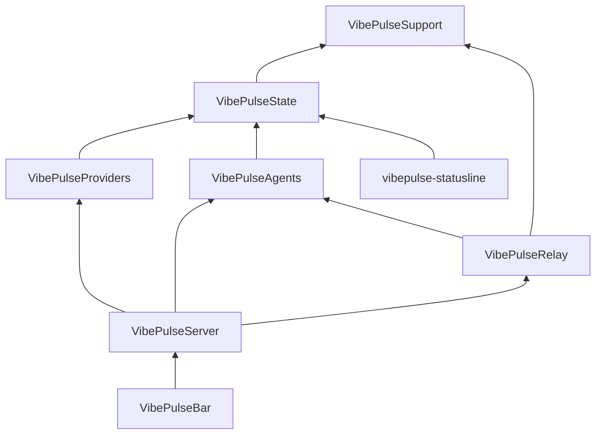

# Native tokenserver — architecture

Status: for review. No Swift engine code until this document is accepted.
Behavioral source of truth: the six specs in this directory. Python in
`tools/tokenserver/` stays, unchanged, as the other implementation and as
the oracle for parity tests.

## 1. What ships

The menu-bar app **is** the server. One process binds the port, probes the
providers, writes the existing state files, and serves the panel. The menu
reads those values in memory. There is no Python child and no engine
switch.

Python remains a complete, separately tested server for Windows, for
launchd, and as the parity oracle. A machine runs one of them. If port
8737 is already taken, the app says who holds it and does not start. It
does not spawn, supervise, or fall back to Python.

## 2. Rules

1. Dependencies point down the diagram in §3. A lower target never imports
   a higher one.
2. Side effects sit behind protocols. Domain types, file formats, and wire
   assembly stay pure and take a clock plus their inputs.
3. One aggregate owns one state file. No second writer.
4. The panel and the menu share one snapshot value. HTTP encodes it; the
   menu renders it. Neither re-derives the other.
5. Bool is not a number. Protocol integers are integers. Crypto JSON is
   byte-exact. LAN JSON carries `Content-Length` and stays under the
   firmware caps in spec 03 §10.
6. A worker failure is caught inside that worker. It becomes a status word,
   never a dead server.
7. Tokens, prompts, and raw account ids are not logged and not placed on
   the wire. Identities are the existing SHA-256 of
   `provider\0scope\0raw`.

## 3. Targets

| Target | Owns | Must not |
|---|---|---|
| `VibePulseSupport` | clocks, strict JSON, canonical JSON, atomic files, quarantine, log, HTTP client, process/keychain/sqlite protocols | know a provider, a route, or a state-file schema |
| `VibePulseState` | `config.json`, `quota-cache.json`, `usage-history.json`, `max-tracker.json`, `prices.json`, value meter | call the network or read transcripts |
| `VibePulseProviders` | Claude OAuth probe, Codex usage/app-server/rollout value, Cursor, Grok, subscription cadence | serve HTTP or know interactions |
| `VibePulseAgents` | agent-status tailer, interaction store, Codex normalizers, statusline sample reader | bind a port |
| `VibePulseRelay` | relay crypto, interaction relay, numbers publisher, GitHub monitor, mDNS | parse transcripts |
| `VibePulseServer` | snapshot assembly, route handlers, listener, engine lifecycle | contain probe algorithms |
| `vibepulse-statusline` | the short-lived hook Claude Code spawns; writes the sample file | link the server or the app |
| `VibePulseBar` | menu, settings, status icon | encode wire JSON or touch state files |

`VibePulseBarCore` is absorbed. Its wire models move to `VibePulseServer`
as the types the encoder emits. The menu imports those types. The Python
supervisor (`ServiceSupervisor`, `ServiceGuard`, `TokenServerClient` as a
service owner) goes away. `LaunchAgentControl` stays, used only to detect
and boot out `se.torget.tokenserver` so this process can bind.

## 4. Protocols

Defined in `VibePulseSupport`, implemented beside the caller that needs a
fake. No protocol grows a method for one call site.

- `Clock`: `wall` (epoch seconds) and `monotonic`. Every store and worker
  takes one. Tests pass a fixed clock.
- `JSONExchanger`: one request, no redirects, timeouts, status, headers,
  body. Shared by Claude, Codex, Cursor, Grok, GitHub, and both relays.
- `SecretStore`: Claude Keychain item `Claude Code-credentials`. The
  reason words in spec 01 §9 are the return value, not a thrown error.
- `ProcessLister`: the Claude Desktop `pgrep`/`ps` lookup. Codex
  `app-server` is a separate `ChildProcess` protocol with a stdin/stdout
  line pump.
- `SQLiteReader`: Cursor's `state.vscdb` query only.
- `FileLock`: non-blocking exclusive lock on `claude-probe.lock` and
  `codex-probe.lock`. This stays a file lock, not an actor, because the
  Python server on the same machine must observe it.
- `Advertiser`: start/stop mDNS `_vibepulse._tcp`.

## 5. Aggregates

Each aggregate is one actor (or a lock around one value, where the Python
lock order is part of the behavior). Cross-process exclusion uses the file
locks above, never a second in-process copy of the same file.

| Aggregate | File | Writers |
|---|---|---|
| `QuotaCache` | `quota-cache.json` | probe results only, through `put` |
| `UsageHistory` | `usage-history.json` | snapshot recorder only |
| `MaxTrackerStore` | `max-tracker.json` | volume observations and quota peaks; one dirty writer |
| `VibePulseConfig` | `config.json` | settings UI, under the existing `config_lock` |
| `ProbeCooldown` | `claude-probe-state.json`, `codex-probe-state.json` | the matching probe |
| statusline sample | the bridge's sample file | `vibepulse-statusline` only; the server only reads |

Atomic write, parent fsync, and corrupt quarantine are `VibePulseSupport`
and match spec 05 §1. A future Python run must open what the app wrote.

## 6. The engine

`VibePulseEngine` is the only type the app holds.

- `start()` binds the port or returns `.portBusy(pid, command)`. It does
  not probe upstream until the bind succeeds, so a failed start cannot
  join the 429 penalty box.
- `snapshot` is the current `/api/tokens` value, updated by the recompute
  task. Route handlers and the menu read it. Building a snapshot is a pure
  function of probe views, history, cache, plans, and the clock.
- `GET /api/tokens` still has its side effect: the call path that serves it
  publishes peaks into Max Tracker before encoding. The menu's read does
  not. Documented so the two do not get "unified" later.
- Workers are structured tasks: transcript scan, Claude probe, Codex probe,
  Cursor/Grok cadence, agent-status poll, Max Tracker backfill, log
  rotation, publisher, interaction relay, GitHub, mDNS. Each loop catches
  its own errors. `stop()` cancels them, flushes Max Tracker, and closes
  the listener, in the order of spec 03 §8.1.
- Probe cadence, bridged slowdown, 429 cooldown (`max(Retry-After, 600)`
  persisted), and dead-token FIFO of 8 stay in the Claude probe. The
  server only asks it for a view.

## 7. HTTP

One listener, `NWListener` or `Network` framework, bound to `0.0.0.0` on
the configured port (default 8737). A small connection cap mirrors
`HTTP_MAX_WORKERS` (32). Over the cap, drain and answer 503 the way spec
03 describes.

GET routes, no Host or Origin check: `/api/tokens`, `/api/agent-status`,
`/api/max-tracker`, `/api/github`, `/`. Anything else is 404
`{"error":"not found"}`.

POST keeps the gate order in spec 03 §3.2 exactly: feature flags, then
loopback and absent-Origin for hook routes, then `Content-Type`, then
dispatch. Answer and panic stay LAN-reachable and HMAC-checked inside the
store. Disabled routes are rejected before the body is parsed, and the
announced body is still drained.

Encoding:

- Crypto frames use a hand-written canonical JSON (sorted keys, no
  whitespace, the escape rules in spec 06 §0). Known-answer vectors from
  `test-vectors/` are copied into the test bundle.
- LAN bodies use one encoder. Insertion order matches the Python payloads
  the firmware tests pin. `Content-Length` is always set. Bodies at or
  above the firmware caps (4096 / 8192 / 768 / 4096) are a test failure,
  not a runtime surprise.

## 8. The statusline hook

Claude Code spawns a command. That command cannot be the app. Target
`vibepulse-statusline` is a few-hundred-line executable: parse stdin,
merge, write the sample file, exit. It links `VibePulseState` and nothing
else. The app reads the sample. The existing Python hook keeps working for
a Python-only install; the app's installer points `~/.claude` at the
native helper when the user installs the app.

## 9. App integration

`AppModel` holds the engine. Menu data comes from `engine.snapshot` and
the agent-status view. Settings keep port, plans, relay, GitHub repo, and
log path. Settings lose Python path, script path, and arguments.

On launch, if `se.torget.tokenserver` is loaded, the menu says so and
offers Take Over: `launchctl disable` + `bootout`, then `engine.start()`.
Hand Back stops the engine and bootstraps the agent again. Take Over of a
foreign pid sends SIGINT and waits; it never starts Python afterward.

Quit cancels the engine. There is no child to signal and nothing to reap.

## 10. Parity

Every pure function gets the tests named in the specs, re-expressed in
Swift against a fixed clock. Crypto uses the checked-in vectors.

One integration test, opt-in like the current real-server test, runs the
Python server and the Swift engine against the same fixture HOME (copied,
because the files are single-writer) and compares `/api/tokens`,
`/api/agent-status`, `/api/max-tracker`, `/api/github`, and `GET /` after
normalization of pid, timestamps, and rev. A mismatch fails the test. The
Python suite is not deleted and not rewritten.

## 11. Build order

The app does not switch to the engine until the last step. Until then the
current Python supervision keeps working.

1. Support, then State, with file-format tests against fixtures written by
   Python.
2. Providers and Agents, pure parts first, then the side-effecting probes
   behind the protocols.
3. Relay, vectors first.
4. Server: snapshot, routes, engine lifecycle, parity test.
5. App: delete the Python supervisor, point the menu at the engine, add
   the statusline helper.

## 12. Explicitly not in this design

- A Swift engine selected from Settings.
- Sharing one process between this app and the Python server.
- Rewriting `update_prices.py` or `smoke.py`. The app reads `prices.json`.
- Changing wire versions or state-file schemas.
