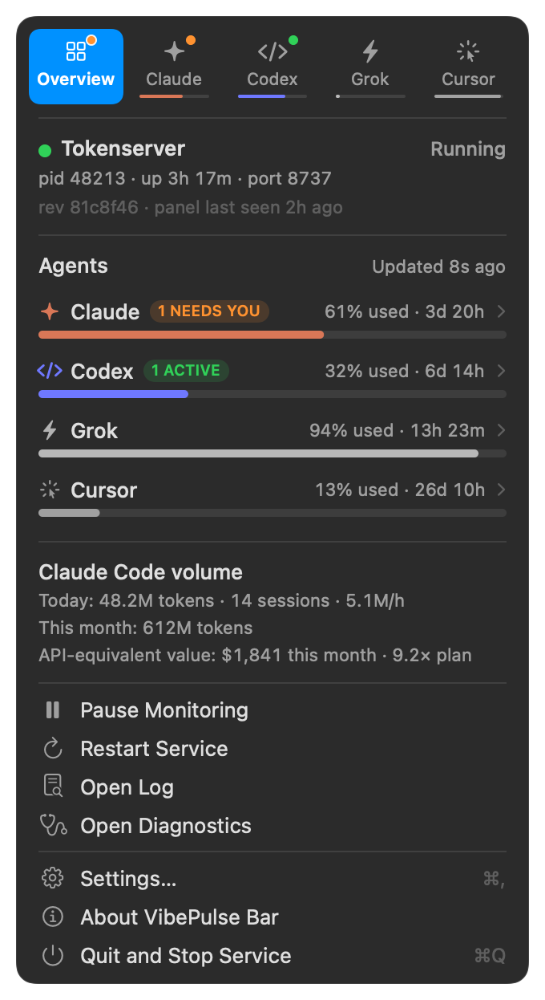
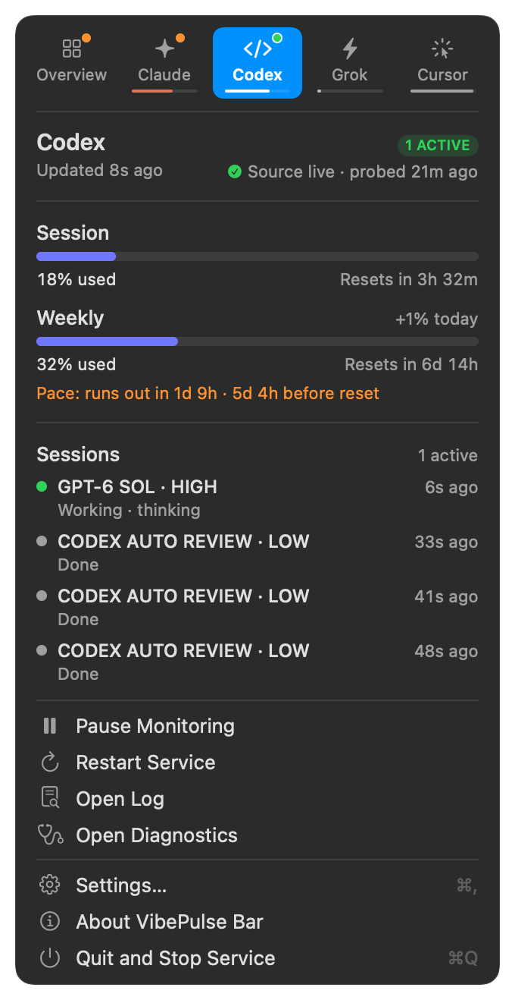
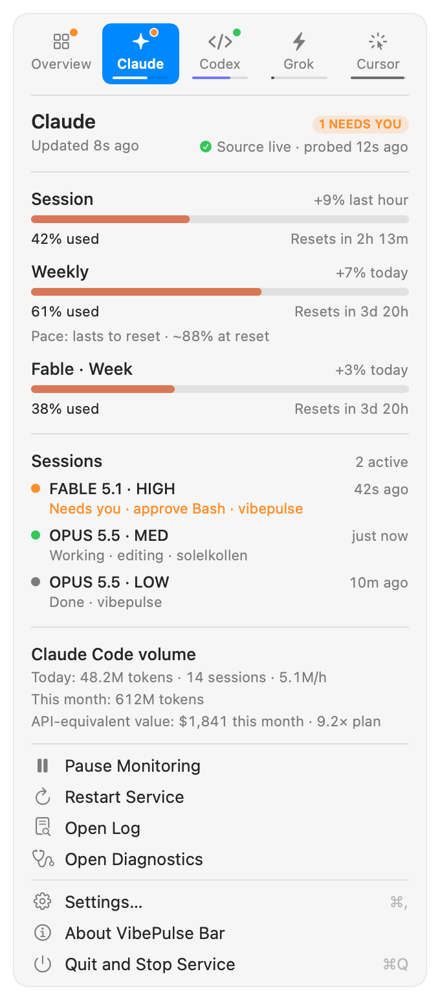

# VibePulse Bar — the tokenserver in your Mac's menu bar

A native macOS menu bar app that runs the VibePulse tokenserver and shows
what it sees. One glance tells you whether the service is up, who started
it, and how much Claude, Codex, Grok and Cursor quota is left; one click
starts or pauses it; quitting the app stops the service it started.

<p>



</p>

The layout follows [CodexBar](https://github.com/steipete/CodexBar): a
provider switcher on top, one card per provider, and plain menu rows below.

## Why it exists

Under launchd the service is invisible: `launchctl print` is the only way
to learn whether it runs, a crash loop shows up as silence on the panel,
and a `python3 tools/tokenserver/tokenserver.py` started from a terminal
keeps running as an orphan (parent pid 1) after the terminal is gone, still
holding port 8737, with nothing that owns it. The app makes ownership
explicit:

| The menu says | Meaning | What you can do |
|---|---|---|
| **Running** | This app started the server and watches it | Pause, Restart; Quit stops it |
| **Paused** | Nothing runs; the menu shows the last data as CACHED with its age | Start |
| **Crashed** | The server died; exit code and its last log lines are shown | Waits 5 s, 10 s, 20 s … 60 s between restarts; Pause stops the loop |
| **Running elsewhere** | Another process serves the port (pid and command shown) | Take Over: stop it gracefully and run it here |
| **Managed by launchd** | The `se.torget.tokenserver` LaunchAgent is loaded | Take Over, or leave it; Restart uses `kickstart -k` |
| **Not responding** | The process lives but `GET /` stopped answering | Restart |
| **Needs setup** | Python or the server script is missing | Settings → Service |

Rules that never bend:

- **Quit stops only what this app started.** A server running elsewhere or
  under launchd is left alone.
- **Stopping is graceful.** SIGINT first, because the server's cleanup
  (Max Tracker flush, relay shutdown) only runs on SIGINT; SIGTERM after
  10 s, SIGKILL after 3 more. A quit during a pause joins that stop rather
  than sending a second SIGINT into the cleanup.
- **Nothing outlives the app.** macOS has no parent-death signal, so the
  server runs through a small launcher the app writes to
  `~/Library/Application Support/VibePulse/vibepulse-bar-guard.py`. It runs
  `tokenserver.py` in the same process, and when the app disappears (a
  crash, Force Quit, `kill -9`) it stops the server through the same SIGINT
  cleanup, with SIGKILL after 10 s. The server leads its own process group,
  so helpers it spawned (the `codex app-server` probe) are cleared with it
  even after a SIGKILL or a crash. A leftover from a crashed run is stopped
  at the next launch, then a fresh server starts. A launch command that
  `exec`s away from the launcher is called out in the menu, because it
  would defeat all of this; a wrapper that uses `runpy` is fine. A second
  copy of the app exits and brings the first one forward.
- **The data is the service's, not the app's.** The menu reads the same
  `/api/tokens`, `/api/agent-status` and `GET /` the panel reads. A missing
  number is a dash, never a zero; data older than two minutes is marked
  CACHED; a forecast is shown only when the window actually runs out before
  its reset.

## Install

Requires macOS 14 or later and the Swift 6 toolchain (Xcode or the Command
Line Tools). Build from a durable checkout, not a PR worktree you will
delete: the app remembers the checkout it was built from.

```sh
tools/vibepulse-bar/build-app.sh --install
```

This builds `tools/vibepulse-bar/dist/VibePulse Bar.app`, copies it to
`~/Applications`, and opens it. Without `--install` it only builds. The
bundle is ad-hoc signed for the Mac that built it and contains no secrets:
the tokenserver reads its own credentials exactly as before.

On first launch the app picks its launch command in this order:

1. what you saved in **Settings → Service**;
2. the command your installed LaunchAgent runs
   (`~/Library/LaunchAgents/se.torget.tokenserver.plist`), including wrapper
   scripts, arguments, environment and port;
3. this checkout's `.venv/bin/python tools/tokenserver/tokenserver.py`.

## Living with the LaunchAgent

Pick one supervisor. If the LaunchAgent is loaded, the app shows **Managed
by launchd** and only observes. **Take Over** runs `launchctl disable` and
`bootout` for `se.torget.tokenserver` and starts the server here; the plist
is never edited or deleted. **Settings → Service → Hand Back to launchd**
reverses it with `enable` and `bootstrap`. Enable **Launch at login** in
Settings → General so the app, and with it the service, starts with your
session.

## Logs

The app writes the server's stdout and stderr to the same
`~/Library/Logs/torget-tokenserver.log` launchd uses, opened in append mode
so the server's in-place rotation keeps working. Its own events land in the
same timeline, marked `vibepulse-bar:`:

```
2026-09-24 03:14:25 INFO vibepulse-bar: started tokenserver pid 48213 via vibepulse-bar-guard.py: /…/python -u /…/tokenserver.py
2026-09-24 06:32:10 INFO vibepulse-bar: stopping tokenserver pid 48213 (paused): SIGINT
2026-09-24 06:32:10 INFO vibepulse-bar: tokenserver pid 48213 exited cleanly after 3h 17m
```

`smoke.py` and the comb routine keep working unchanged. **Open Log** and
**Open Diagnostics** (the server's `GET /`) are one click away in the menu.

## Development

```sh
cd tools/vibepulse-bar
swift build
swift test                         # parsing, pace rules, config import, and a
                                   # real supervisor run against a fake server
VPBAR_REAL_TOKENSERVER=1 swift test  # also start, pause, restart and quit the
                                     # real tokenserver.py in a scratch HOME
./build-app.sh --previews /tmp/p   # render the menu states as PNGs
```

The real-server test needs Python 3.11+ (`VPBAR_PYTHON`, default
`/opt/homebrew/bin/python3`); CI runs it on every push. It uses a scratch
HOME and a free port, so it never reads your credentials or touches the
service you are running.

`Sources/VibePulseBarCore` holds everything testable (wire models, the
supervisor, configuration, launchctl); `Sources/VibePulseBar` is SwiftUI.
The screenshots above are `--previews` output from the fixtures in
`Tests/VibePulseBarCoreTests/Fixtures`, so they show real layout with
illustrative numbers.
